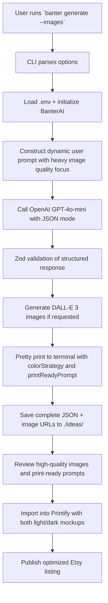

# BanterWearCo Idea Generator - Design Document

## Overview

This system is an AI agent specialized in generating **high-performing Print-on-Demand (POD) products** for the BanterWearCo Etsy shop. **Image quality is the highest priority** - every design is engineered to be top-tier, unique, and work excellently on both light and dark clothing. It combines deep Etsy SEO knowledge, premium humorous graphic design principles, and current meme culture.

## Architecture

### Core Components

1. **CLI Layer** (`src/cli.ts`)
   - User interface using Commander.js
   - Beautiful terminal output with Boxen + Chalk
   - File output management (JSON + timestamped folders)

2. **AI Service Layer** (`src/ai.ts`)
   - Specialized `BanterAI` class with **heavy emphasis on image quality**
   - Sophisticated system prompts optimized for POD design excellence
   - DALL-E 3 integration for actual high-quality image generation
   - Structured output using Zod validation + OpenAI JSON mode (now includes `printReadyPrompt`, `colorStrategy`)
   - Dual prompt strategy: general `imagePrompt` + specialized `printReadyPrompt`
   - Error handling and rate limiting for both text and image generation

3. **Type System** (`src/types.ts`)
   - Zod schema for `ProductIdea` ensuring consistent, usable output
   - Strong typing for all generation options

4. **Prompt Engineering** (see `PROMPTS.md`)
   - Carefully crafted system prompt encoding brand voice
   - Detailed output schema instructions
   - Examples from existing BanterWearCo products

### Data Flow

**Key Enhancement**: Image generation is now first-class. The system produces both a general `imagePrompt` and a specialized `printReadyPrompt` optimized for POD production that works on both light and dark clothing.

### Key Design Decisions

1. **Image Quality First Architecture**
   - Image generation is the **highest priority** - not an afterthought
   - System prompt heavily emphasizes high contrast, dual-clothing compatibility, print-ready standards
   - Separate `imagePrompt` and `printReadyPrompt` fields for different use cases
   - DALL-E 3 integration for actual top-tier image generation (1024x1024, commercial quality)

2. **Color Strategy Engineering**
   - Every design includes explicit `colorStrategy` guidance
   - Prompts specifically call out "works on both black and white shirts"
   - Recommendations for outlines, negative space, and color palettes that maintain readability across backgrounds

3. **Structured Output Strategy**
   - JSON mode + Zod validation guarantees consistent, production-ready fields
   - Extended schema now includes `printReadyPrompt` and `colorStrategy`
   - Easy to extend for future Printify API automation

4. **Brand Voice + Design Excellence**
   - System prompt encodes both humor style AND senior graphic design principles
   - References real BanterWearCo products while pushing for unique, premium executions
   - Temperature tuned for creativity while maintaining strict POD constraints

## Prompt Engineering Strategy

See `PROMPTS.md` for full details.

Core principles:
- **Specificity**: Reference real products ("Psycho Bakery", dinosaur themes, baby oil joke)
- **Constraints**: One strong concept per design, punchy text, simple-but-clever visuals
- **Output Format**: Extremely strict JSON schema instructions
- **Creativity Balance**: Temperature 0.9 with strong brand guardrails

## Future Enhancements

### Phase 2
- Direct Printify API integration (auto-create products)
- Image generation via Flux/SD API (end-to-end)
- Web UI dashboard with history and favorites
- A/B testing suggestion engine for titles/tags

### Phase 3
- Multi-agent system (separate agents for concept, SEO, visual direction)
- Trend analysis integration (Google Trends, TikTok API)
- Performance analytics from Etsy sales data
- Automated listing creation

## Success Metrics

- Ideas feel **native** to BanterWearCo voice with distinctive humor
- Generated titles and tags drive strong Etsy search performance
- **Image quality is exceptional** - unique, top-tier designs that work beautifully on both light and dark clothing
- `colorStrategy` and `printReadyPrompt` fields enable immediate production use
- DALL-E 3 images (when requested) are commercial quality and ready for mockups
- High conversion rate when listed on Etsy (tracked via sales data)

This design prioritizes **premium image quality and POD practicality** first, followed by humor, SEO, and automation extensibility.

**Last Updated**: April 2026
